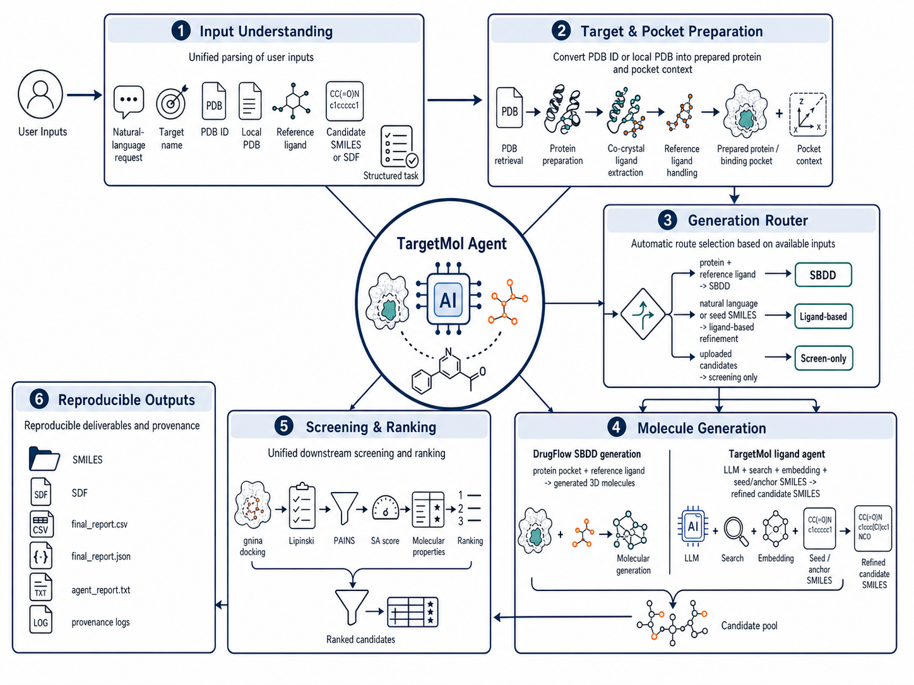

# TargetMol

[](LICENSE)
[](pyproject.toml)
[](examples/results/README.md)

TargetMol is a target-driven molecular generation and screening agent for computational hit discovery. It accepts natural-language requests, PDB IDs, local protein structures, reference ligands, and user-provided candidate molecules, then routes the task through structure-based generation, ligand-based refinement, or direct screening.

The system is designed for reproducible research workflows. Each run creates a structured output directory with normalized inputs, intermediate files, provenance records, ranked candidates, and a natural-language agent report.

> TargetMol is a computational pipeline. Its outputs are not experimental validation results and should not be interpreted as confirmed drug candidates.

## Overview

TargetMol supports three main workflows:

| Workflow | Input condition | Route | Output |
| --- | --- | --- | --- |
| Structure-based generation | Protein structure with reference ligand, or PDB ID with extractable ligand | `sbdd_drugflow` | Generated molecules, normalized SMILES, screening report |
| Direct candidate screening | Uploaded SMILES or SDF candidates | `screen_only` | Docking, molecular properties, filters, ranked candidates |
| Ligand-based agent refinement | Natural-language target request without reliable structure | `ligand_based_targetmol` | Grounded target context, generated candidates, iterative refinement trace |



## Key Features

- Unified CLI and single YAML configuration file.
- Automatic route selection from PDB ID, local PDB, reference ligand, candidate SMILES/SDF, or natural-language request.
- PDB preparation and co-crystal ligand extraction for structure-driven workflows.
- DrugFlow adapter for pocket-conditioned molecular generation.
- Native TargetMol screening pipeline with docking, Lipinski, PAINS, SA score, basic molecular properties, ranking, and final reports.
- LLM-assisted ligand-based workflow with target grounding, search evidence, embedding-based evidence ranking, candidate expansion, and iterative molecular refinement.

## Installation

Clone the repository and create a Python environment:

```bash
git clone https://github.com/CC-HH-NN/targetmol.git
cd targetmol

python3 -m venv .venv
.venv/bin/python -m pip install -U pip
.venv/bin/python -m pip install -e .
```

For real docking and molecular-property calculation, the runtime environment must also provide:

- RDKit
- gnina
- [DrugFlow](https://github.com/LPDI-EPFL/DrugFlow) and a compatible DrugFlow checkpoint if structure-based generation is enabled

## Configuration

Copy the public template and fill in local paths and API keys:

```bash
cp targetmol.example.yaml targetmol.yaml
```

Common fields to configure:

- `models.chat_api_key`: OpenAI-compatible chat model key.
- `models.embedding_api_key`: OpenAI-compatible embedding model key.
- `search.serper_api_key`: optional web-search key for target grounding.
- `drugflow.repo_dir`: local DrugFlow repository path.
- `drugflow.checkpoint`: DrugFlow inference checkpoint.
- `tools.gnina`: gnina executable path.
- `runs_dir`: output directory for TargetMol runs.

## Quick Start

Run TargetMol with a PDB ID and natural-language task:

```bash
.venv/bin/python -m targetmol.cli \
  --config targetmol.yaml \
  --pdb-id 6JX0 \
  --request "Design EGFR inhibitors" \
  --run-name quickstart_6jx0
```

## Example Workflows

### 1. Structure-Based Generation

Use a local protein structure and reference ligand:

```bash
.venv/bin/python -m targetmol.cli \
  --config targetmol.yaml \
  --pdb-file DrugFlow/examples/kras.pdb \
  --reference-ligand DrugFlow/examples/kras_ref_ligand.sdf \
  --run-name kras_sbdd
```

### 2. PDB ID with Automatic Routing

Use a PDB ID and natural-language task:

```bash
.venv/bin/python -m targetmol.cli \
  --config targetmol.yaml \
  --pdb-id 6JX0 \
  --request "Design EGFR inhibitors" \
  --run-name egfr_sbdd
```

### 3. Uploaded Candidate Screening

Screen an existing SMILES file:

```bash
.venv/bin/python -m targetmol.cli \
  --config targetmol.yaml \
  --pdb-id 6JX0 \
  --candidate-smiles-file examples/inputs/smiles_examples.txt \
  --run-name egfr_screening
```

Screen an uploaded SDF file:

```bash
.venv/bin/python -m targetmol.cli \
  --config targetmol.yaml \
  --request "Screen uploaded candidates against 6JX0" \
  --candidate-file candidates.sdf \
  --run-name sdf_screening
```

### 4. Natural-Language Ligand Agent

Run the ligand-based route when no reliable structure or reference ligand is available:

```bash
.venv/bin/python -m targetmol.cli \
  --config targetmol.yaml \
  --request "Design EGFR inhibitors for lung cancer" \
  --run-name egfr_ligand_agent
```

Additional examples are available in [`examples/`](examples/). Sanitized output excerpts are available in [`examples/results/`](examples/results/).

## Outputs

Each run is saved under:

```text
runs/<timestamp>_<run_name>/
```

Typical outputs include:

- `provenance/planned_steps.json`: planned route and execution steps.
- `provenance/execution_index.json`: executed steps and outputs.
- `provenance/commands.jsonl`: command records with redacted sensitive values.
- `normalized/`: standardized SMILES and converted candidate files.
- `route/`: grounding, generation, and refinement intermediates.
- `screening/final/final_report.json`: structured screening report.
- `screening/final/final_report.csv`: ranked candidate table.
- `final/summary.txt`: concise run summary.
- `final/agent_report.txt`: natural-language agent report.

## License

TargetMol source code is released under the MIT License. See [`LICENSE`](LICENSE).

## Citation

If you use TargetMol in academic work, please cite this repository. A formal citation entry will be added when available.
